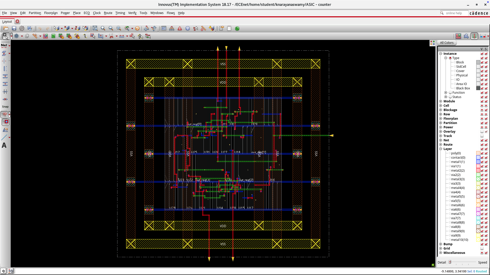
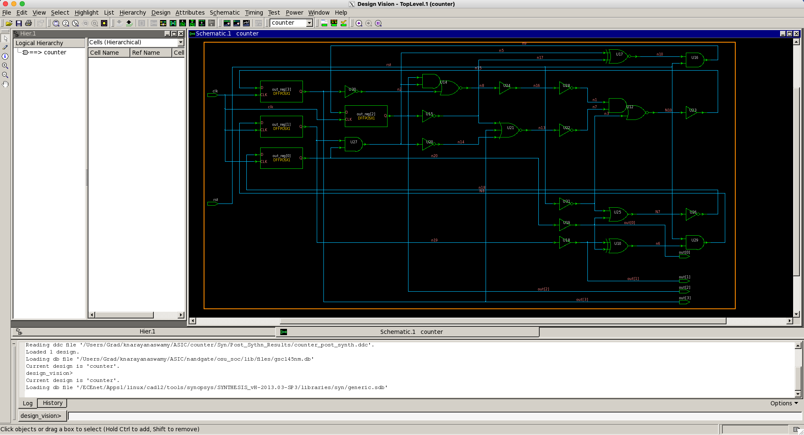
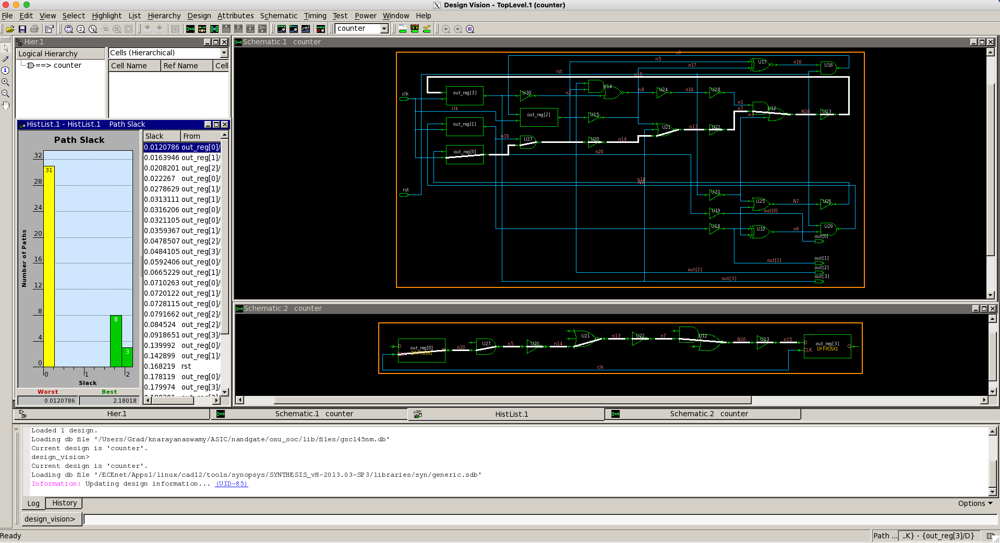

# Counter Physical Design Project (RTL to GDSII)

## Overview
This project demonstrates the complete **ASIC Physical Design flow** for a simple **4-bit counter**, starting from RTL design to final GDSII layout.  
The flow covers:
- RTL design and simulation
- Synthesis to gate-level netlist
- Gate-level verification
- Place & Route (P&R)
- Timing analysis and optimization
- Final GDSII generation ready for tape-out

---

## Tools Used

| Stage                         | Tool & Vendor                         |
|--------------------------------|----------------------------------------|
| RTL Coding & Simulation        | **Cadence NCLaunch** (Cadence Inc.)    |
| RTL Testbench Simulation       | **Cadence NCLaunch**                   |
| Synthesis                      | **Synopsys Design Compiler (DC)**      |
| Gate-level Netlist Viewing     | **Design Vision** (Synopsys)           |
| Physical Design (P&R)          | **Cadence Innovus Implementation System** |
| GDSII Export                   | **Cadence Innovus**                    |
| Timing Analysis                | Built-in STA within Cadence Innovus    |

---

## Project Flow

1. **RTL Design**
   - Developed a **4-bit synchronous counter** in Verilog.
   - Verified RTL functionality using **Cadence NCLaunch** with a self-checking testbench.
   - Generated simulation waveforms for functional verification.

2. **Synthesis**
   - Used **Synopsys Design Compiler** to synthesize RTL into a **gate-level netlist**.
   - Mapped the design to a standard cell library.
   - Generated synthesis reports for **timing, area, and power**.

3. **Gate-Level Netlist Viewing**
   - Opened synthesized netlist in **Design Vision** for visualization and verification.
   - Verified proper cell instantiation and net connectivity.

4. **Floorplanning**
   - Defined core and die area.
   - Created power/ground rings and IO pin placements.

5. **Placement**
   - Placed standard cells using **Cadence Innovus**.
   - Performed legalization and cell density optimization.

6. **Clock Tree Synthesis (CTS)**
   - Inserted clock buffers to balance skew and meet timing.

7. **Routing**
   - Routed signal nets, clock nets, and power distribution.
   - Checked for **DRC violations** and ensured clean routing.

8. **Timing Analysis**
   - Performed **Static Timing Analysis (STA)** for setup and hold times.
   - Ensured design meets target frequency with no timing violations.

9. **GDSII Export**
   - Generated final **GDSII layout** using **Cadence Innovus**.
   - Ready for fabrication.

---

## Results

| Parameter               | Value |
|-------------------------|-------|
| Target Frequency        | 3.33 GHz |
| Core Area               | 95.27 µm² |
| Power Consumption       | 0.2922 mW |
| DRC Violations          | 0     |
| LVS Errors              | 0     |

---
## 📊 Timing Analysis
**From Synthesis Report:**
- **Clock Name:** `ideal_clock1`
- **Clock Period:** 0.3 ns  
- **Target Frequency:** **3.33 GHz**
- **Slack:** +0.01 ns (Timing MET ✅)
- **Worst Path:** `out_reg[0]` → `out_reg[3]`
- **Technology:** 45 nm (gscl45nm), typical corner

## ---

## Screenshots

### Layout View

### Post-Synthesis Schematic Diagram

### Critical Path Diagram

---

## Author

- **Name:** Kruthi Narayana Swamy 
- **Role:** Graduate Teaching Assistant | Digital Design Enthusiast  
- **Skills:** RTL Design, Synthesis, Physical Design, Timing Analysis, Cadence Tools, Synopsys Tools  
- **GitHub:** [kruthi2316](https://github.com/kruthi2316)  
- **LinkedIn:** [linkedin.com/in/kruthi-n](https://www.linkedin.com/in/kruthi-n)  

---

*Last updated: August 2025*